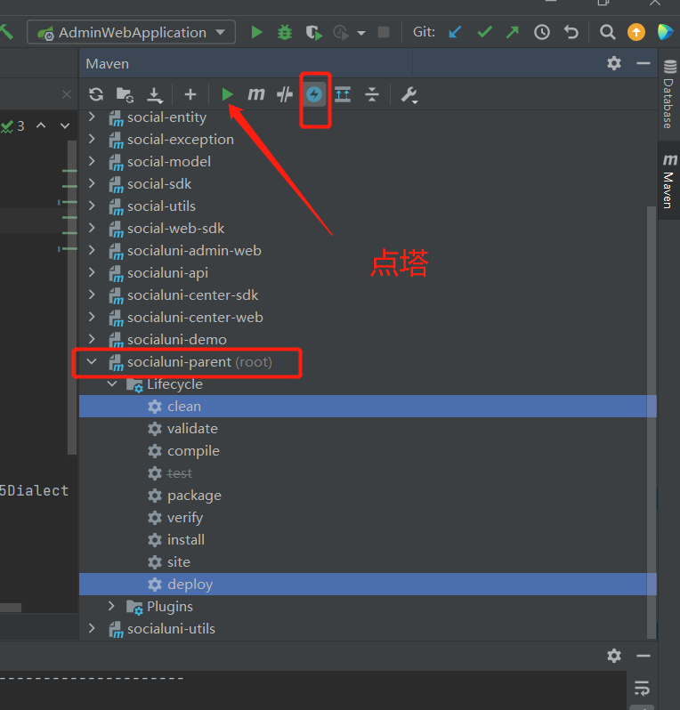

# 搭建开发环境

下载项目

打开


编译一下




配置redis


run


# 部署到linux的步骤


### 目录结构


- 打包


- 上传把jar到服务器中

- vi shutdown.sh

  ```shell
  #! /bin/bash
  port=$1
  echo $port
  #根据端口号查询对应的pid
  pid=$(netstat -nlp | grep :$port | awk '{print $7}' | awk -F"/" '{ print $1 }');
  
  #杀掉对应的进程，如果pid不存在，则不执行
  if [  -n  "$pid"  ];  then
              kill  -9  $pid;
  fi
  ```

  

- vi deploy.sh

  ```shell
  #! /bin/bash
  # kill 
  sh shutdown.sh 8093
  # run
  nohup java -server -Xms400m -Xmx400m -XX:NewSize=200m -XX:MaxNewSize=200m \
          -jar -Dspring.profiles.active=wlh socialuni-demo-0.2.0.jar \
          --spring.config.addition-location=/home/ubuntu/project/socialuni/application-wlh.yml \
          &
  ```

 

- 上传application-wlh.yml自己的配置文件

- 并且配置ssl

  

- sh deploy.sh

