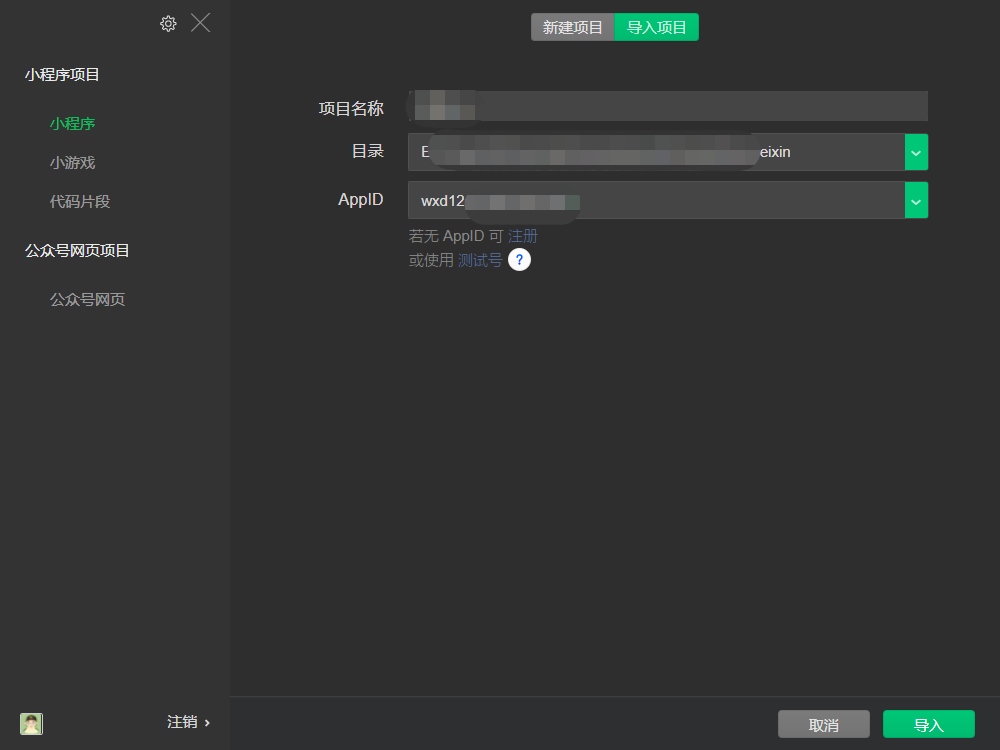

## 修改logo信息


## 打包

- 运行命令行

`npm run build:mp-weixin`

- 报错可以忽略


### 小程序设置

- 开发管理 -》 开发设置 -》 服务器域名


```
request合法域名: 
https://api.map.baidu.com;https://api.qingchi1.com;https://api.qingchiapp.com;https://apis.map.qq.com;https://cdn.bootcss.com;https://cdxapp-1257733245.cos.ap-beijing.myqcloud.com;https://devcdxapp-1257733245.cos.ap-beijing.myqcloud.com;https://h5.shangjb.com;https://localpc.qingchiapp.com;https://ministar.qingchiapp.com;https://mp.qingchiapp.com;https://qkypc.qingchi1.com;https://qkypc.qingchi1.com:8091;https://qkypc.qingchiapp.com;https://qkypc.qingchiapp.com:8091;https://qkypc.qingchiapp.com:8092;https://restapi.amap.com;https://social.qingchiapp.com;https://tongji.dcloud.io;https://www.mxnzp.com;https://www.qingchi1.com;https://www.qingchi1.com:8091;https://www.qingchiapp.com;

socket合法域名:
wss://api.qingchi1.com;wss://api.qingchiapp.com;wss://h5.shangjb.com;wss://localpc.qingchiapp.com;wss://ministar.qingchiapp.com;wss://mp.qingchiapp.com;wss://qkypc.qingchi1.com;wss://qkypc.qingchi1.com:8091;wss://qkypc.qingchiapp.com;wss://qkypc.qingchiapp.com:8091;wss://qkypc.qingchiapp.com:8092;wss://social.qingchiapp.com;wss://www.qingchi1.com;wss://www.qingchi1.com:8091;wss://www.qingchiapp.com;

uploadFile合法域名:
https://api.qingchi1.com;https://api.qingchiapp.com;https://cdxapp-1257733245.cos.ap-beijing.myqcloud.com;https://devcdxapp-1257733245.cos.ap-beijing.myqcloud.com;https://h5.shangjb.com;https://localpc.qingchiapp.com;https://ministar.qingchiapp.com;https://mp.qingchiapp.com;https://qkypc.qingchi1.com;https://qkypc.qingchi1.com:8091;https://qkypc.qingchiapp.com;https://qkypc.qingchiapp.com:8091;https://qkypc.qingchiapp.com:8092;https://social.qingchiapp.com;https://www.qingchi1.com;https://www.qingchi1.com:8091;https://www.qingchiapp.com;

downloadFile合法域名:
https://api.qingchi1.com;https://api.qingchiapp.com;https://cdxapp-1257733245.cos.ap-beijing.myqcloud.com;https://devcdxapp-1257733245.cos.ap-beijing.myqcloud.com;https://localpc.qingchiapp.com;https://ministar.qingchiapp.com;https://mp.qingchiapp.com;https://qkypc.qingchi1.com;https://qkypc.qingchi1.com:8091;https://qkypc.qingchiapp.com;https://qkypc.qingchiapp.com:8091;https://qkypc.qingchiapp.com:8092;https://social.qingchiapp.com;https://www.qingchi1.com;https://www.qingchi1.com:8091;https://www.qingchiapp.com;


```


- 微信登录，秘钥生成。。
  


- UGC申明: 


> 审核机制说明， 使用腾讯云的内容安全产品，有官方审查人员对违规内容进行审查。
> 提供用户举报功能，用户可以对于违规内容进行举报，举报后有运营人员进行审核，对违规内容处理


- 导入项目




