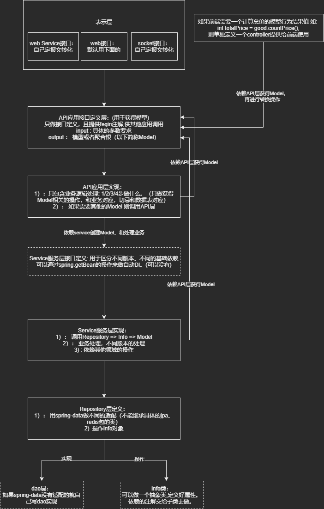

# 开发规范
## 前言
该项目需要不断被迭代，保证项目不被腐蚀和老化。目前是单体，后期会变微服务。 采用DDD的思想。
## 概念解释
- 模型（Model）: 承载着业务的属性和具体的行为，是业务表达的方式、是DDD的内核。模型分为Entity、Value Object、Service这三种类型
- Aggreagte （聚合根）: 封装Model，一个Mode中l可能包含其他Model
- Repository (数据源) ： 数据源的访问网关层、通过Repository来对接不同的数据源
- Factory （工厂） ： 用来创建Model，以及帮助Repository (数据源)注入到Model中 
- DDD模型的边界：  限界上下文，领域边界上下文 ； 防腐（防止域上下文不一致产生的冲突）
## DDD模型的边界和模型域
### 限界上下文，领域边界上下文
- 域的拆分
- 按业务抽象进行划分
- 一个业务拆分成几个独立的域，每个域又可细拆成不同子域
### 防腐
- 一个域在访问其他域的模型时，把获取到的模型做层转换映射到自己域的模型中（不直接使用别的域模型作为自己域模型中的一部分）
- 防止源域模型发生变更，依赖源域模型的调用方，在需要源域模型新功能时，必须要全局依赖修改，才在能兼容
- 防止域上下文不一致产生的冲突

## 开发架构图
基于spring-cloud的开发规范分层架构图。

## 包名规范
- view: 前端需要额外的接口数据
- api: API应用接口定义层
- controller: API应用层实现
- service: Service服务层实现
- repository: repository层额外定义。
- model : 模型领域对象
- info : 表对象

# 命名规范
- 再实体中(@lombok.Data)注解的模型中，判断用judge，不能用is和实体冲突。
- 校验用valid开头，如果不通过内部自动抛异常。
# 包名定义规范
1. common 做技术层的封装。 完全和业务没有关系。 如对工具类的封装，通用查询，通用的适配，公共的配置类。
2. xxx-sdk 对某个领域的一些对外提供的接口。 也就是说其他领域可以直接调用的。
   model 领域实体.
   api   领域对外提供的功能。  (openfegin)
   facade 封装该领域的一些常用的静态方法。

3. xxx   依赖 xxx-sdk 为领域定义的具体实现。         
   service 业务层。   技术性代码/其他service的业务/   QO(xx,xx2,xx3, xxx4 参数多的时候传参容易传错 )    RO

   entity  数据库对应的实体。
   repository 仓库层。     data.repository  =>   jpa 不建议。

   controller 对api领域的具体实现，和额外提供的一些操作(统计/查询)。

com.socialuni.social.模块

tool包下面 ： 也是工具类，不包含业务。  但是都是必须new才能用的，里面带属性。
facade ： 静态类，提供领域的一些常用的方法。减少其他领域做防腐层的建设。 内部依赖的类尽可能用@ConditionalOnMissingBean做业务层可以扩展的方式。

项目根路径包名和启动类，如下所示: 
com.socialuni.common
com.socialuni.xxx.sdk
com.socialuni.xxx
com.socialuni
    xxxApplication

com.socialuni.xxx22
com.socialuni
    xxx22Application

# 领域划分
用户基本信息领域.   user( 单独不依赖任何域，可以切换uni-cloud的用户体系 )
开发者领域. 		tance( 单独不依赖任何域 )
用户会员领域  		member ( 依赖user域 )
贴子领域.   		talk(依赖user、tance、member域)    -》  user-sdk( user的项目jar);  
IM领域.     		im(依赖user、tance域 ， 可以用openIM )

开发者领域  贴子领域   =》 那些数据可以共享（）

# 参考资料
- [领域驱动设计(DDD)-基础思想](https://zhuanlan.zhihu.com/p/109114670)

