# 配置腾讯cos
## 感谢灵辉编写详细的配置（踩坑）手册

## 开通腾讯cos

- 公有读私有写
- 其他都是默认的

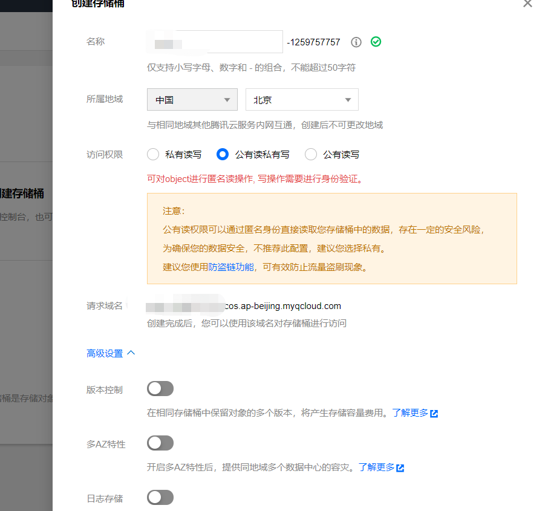

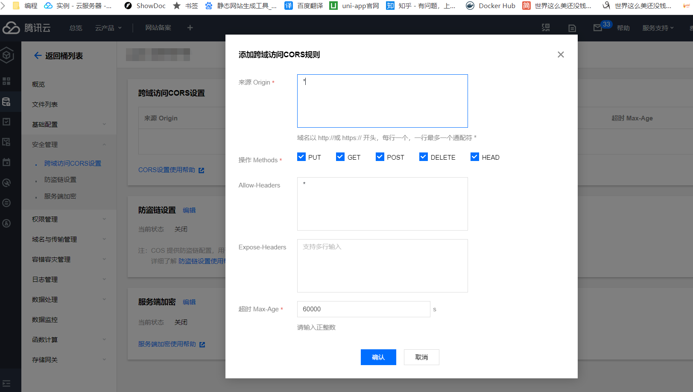

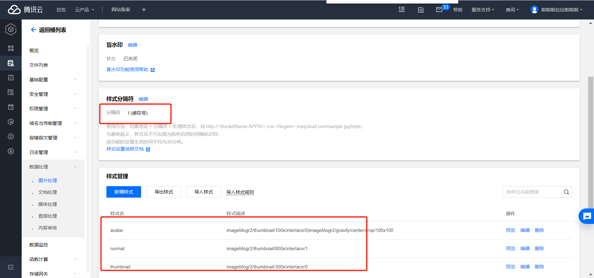

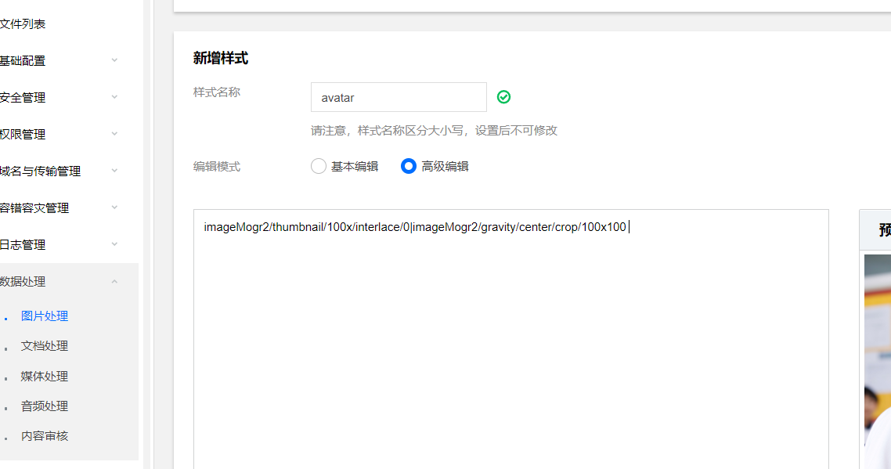

```txt

avatar imageMogr2/thumbnail/100x/interlace/0|imageMogr2/gravity/center/crop/100x100 
normal imageMogr2/thumbnail/800x/interlace/1 
thumbnail imageMogr2/thumbnail/300x/interlace/0 

```


## 前端配置

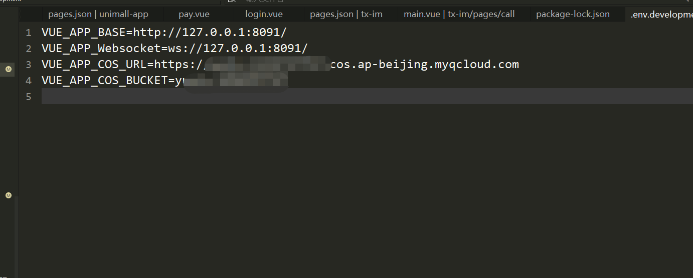

## 后端配置

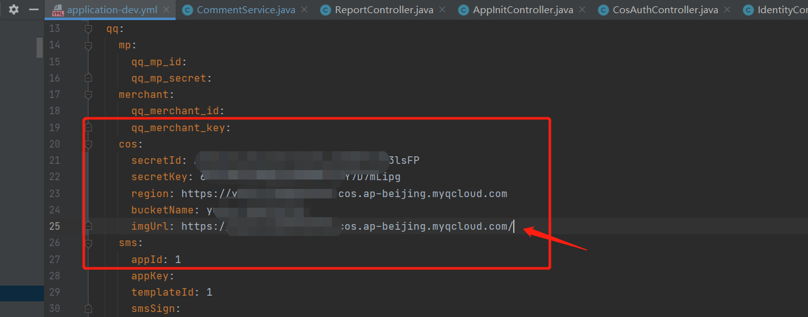

>  注意imgUrl地址为: region  加一个/


# 腾讯短信

## 开通短信

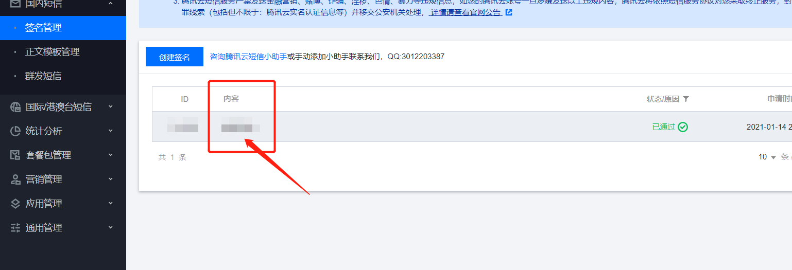

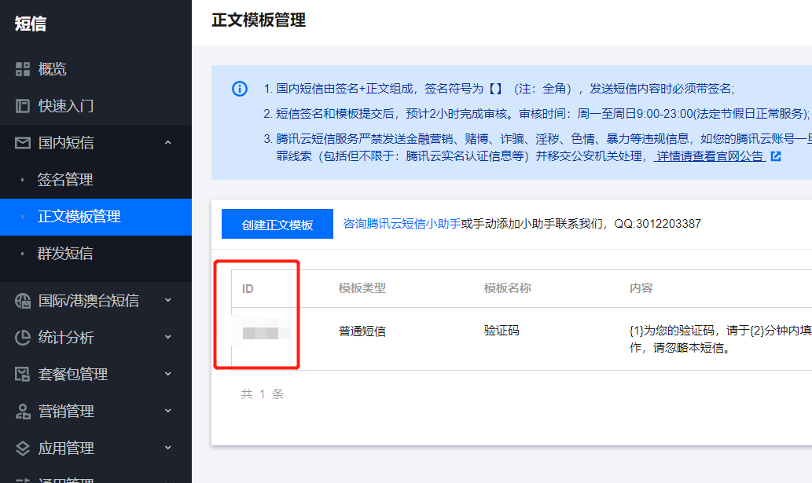

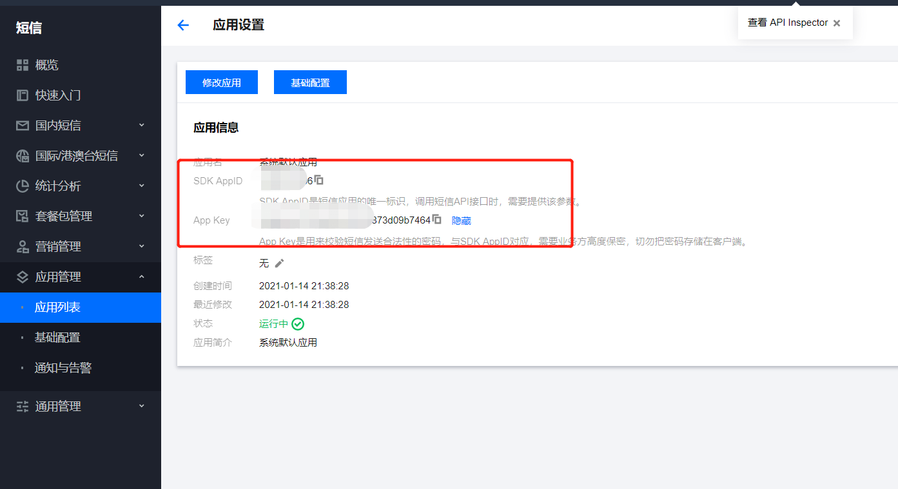

## 后端配置

- https://cloud.tencent.com/document/product/382/13613

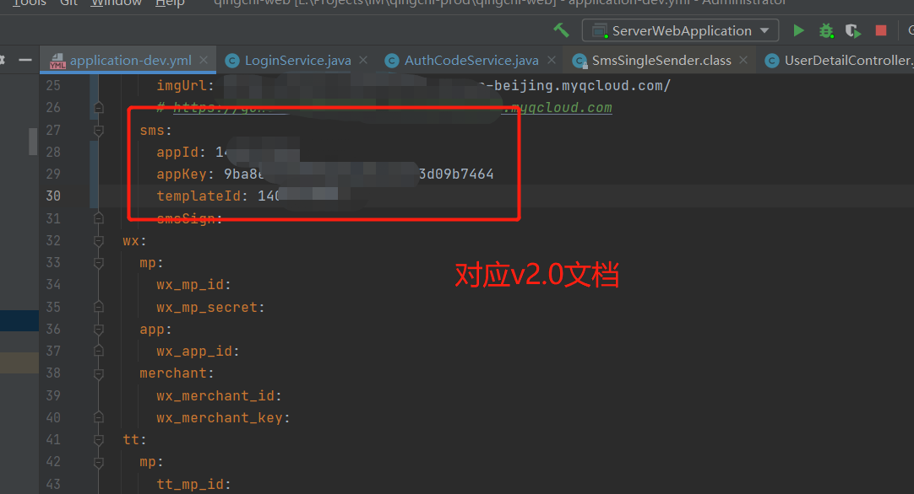


# 上线打包说明

## 前端配置

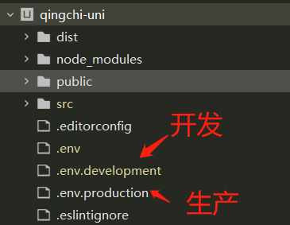

> 把配置项到生产配置一遍，打包正常云打包就行了。
