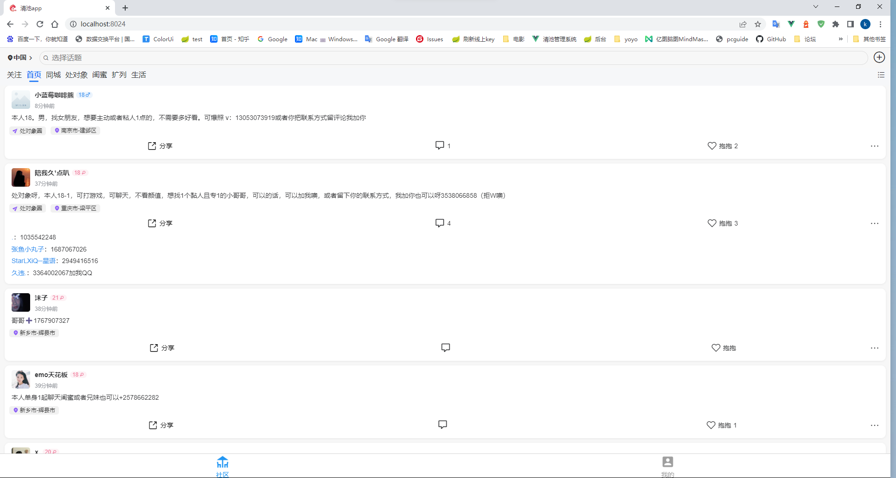

## 产品体验，已上线两款产品，清池和小星星

### 开发者基于此项目，三分钟就可以开发一款与展示项目相同的小程序

* 有自己项目，或者想自己做个项目的朋友欢迎入群交流，大家一起讨论变现，接广告，如何做好产品相关问题

<table>
  <thead>
  <tr>
    <th>我的微信，进社交软件app交流群可以加我，互相学习，讨论问题</th>
    <th>清池</th>
    <th>小星星</th>
  </tr>
  </thead>
  <tbody>
  <tr>
      <td align="center" valign="middle">
        
      </td>
      <td align="center" valign="middle">
        
      </td>
      <td align="center" valign="middle">
         
      </td>
    </tr>
  <tr></tr>
  </tbody>
</table>

# 入门

## 项目地址 [https://gitee.com/socialuni/socialuni](https://gitee.com/socialuni/socialuni)

## 社交联盟是什么？

社交联盟是开发社交软件的一套集成解决方案，使您可以快速搭建一款满足运营要求的社交软件，社交联盟提供开源的社交软件代码模板和开放非隐私的用户社交数据供您使用

## 快速开始

社交联盟代码模板分为前后端两个模块，本示例仅展示独立项目使用方式，如需要嵌入已有系统，请参考更多用法

### 后端模块

1. 使用git clone https://gitee.com/socialuni/socialuni.git
2. 打开socialuni项目，使用maven，install 安装socialuni-parent目录，安装后出现下图中内容则代表安装成功


3. 安装成功后，启动socialuni-web项目，控制台出现以下内容则项目启动成功


4. 在浏览器中输入 [https://localpc.socialuni.cn:8091/socialuni/talk/queryTalks](https://localpc.socialuni.cn:8091/socialuni/talk/queryTalks)


看到以下内容，则代表成功从中心获取到了动态数据

5. 接下来则可以开始配置前端模块

### 前端模块

1. 打开socialuni目录中的socialuni-js项目
2. 在socialuni-js项目中的根目录执行
```
npm install
```
3. install成功后执行，控制台出现下图内容则代表启动成功
 ```
npm run serve
```

4. 使用浏览器打开 [http://localhost:8024/](http://localhost:8024/)，出现此图，则代表项目启动成功




## 代码架构介绍

## 前排寻求对社交和im感兴趣的小伙伴一同合作开发

## 接基于本项目的社交软件部署搭建和二次开发

## 愿景，让社交软件开发更容易，提供用户模块、社区模块，im模块三部分独立的sdk，前端组件，提供社交软件需要的用户数据、运营、商业化变现支持

## 社交联盟项目，提供中心化的用户动态数据，提供社交项目前后端模板，帮助开发者快速开发一个满足运营需求，有真实用户和流量的社交软件
