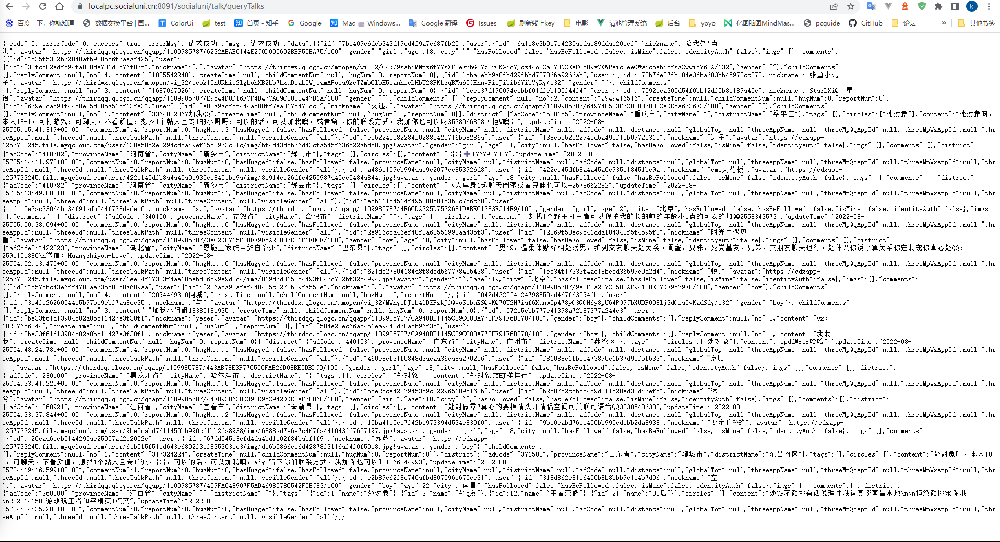
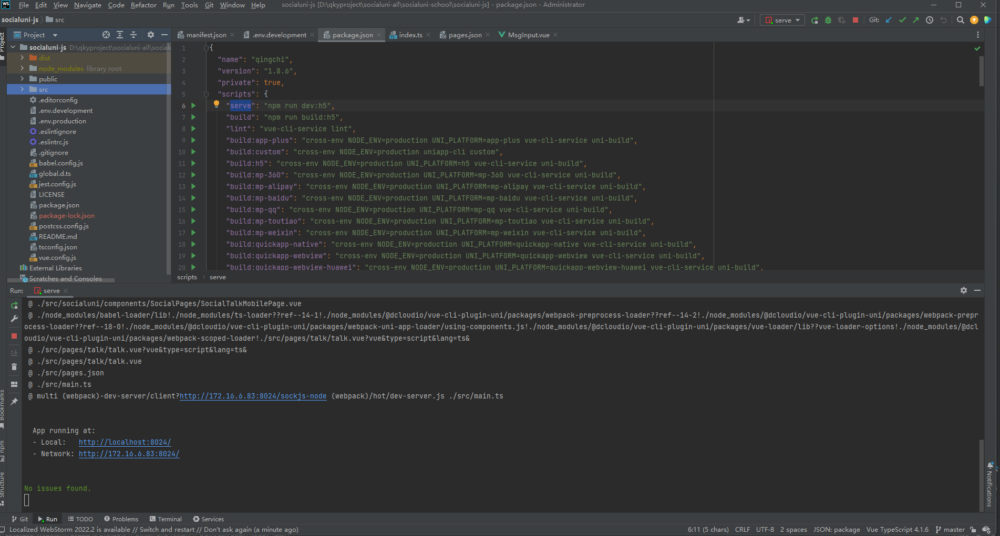

# 入门

## 项目地址 [https://gitee.com/socialuni/socialuni](https://gitee.com/socialuni/socialuni)

## 社交联盟是什么？

社交联盟是开发社交软件的一套集成解决方案，使您可以快速搭建一款满足运营要求的社交软件，社交联盟提供开源的社交软件代码模板和开放非隐私的用户社交数据供您使用

## 代码架构
社交联盟基于 uniapp 和 java开发，支持快速发布小程序、app、web各平台

## 快速开始

社交联盟代码模板分为前后端两个模块，本示例仅展示独立项目使用方式，如需要嵌入已有系统，请参考更多用法

### 后端模块

1. 使用git clone https://gitee.com/socialuni/socialuni.git
2. 打开socialuni项目，使用maven，install 安装socialuni-parent目录，安装后出现下图中内容则代表安装成功


3. 安装成功后，启动socialuni-web项目，控制台出现以下内容则项目启动成功


4. 在浏览器中输入 [https://localpc.socialuni.cn:8091/socialuni/talk/queryTalks](https://localpc.socialuni.cn:8091/socialuni/talk/queryTalks)



看到以下内容，则代表成功从中心获取到了动态数据

5. 接下来则可以开始配置前端模块

### 前端模块

1. 打开socialuni目录中的socialuni-js项目
2. 在socialuni-js项目的根目录执行 
```
npm install
```
3. install成功后执行，控制台出现下图内容则代表启动成功
 ```
npm run serve
```

4. 使用浏览器打开 [http://localhost:8024/](http://localhost:8024/)，出现此图，则代表项目启动成功


