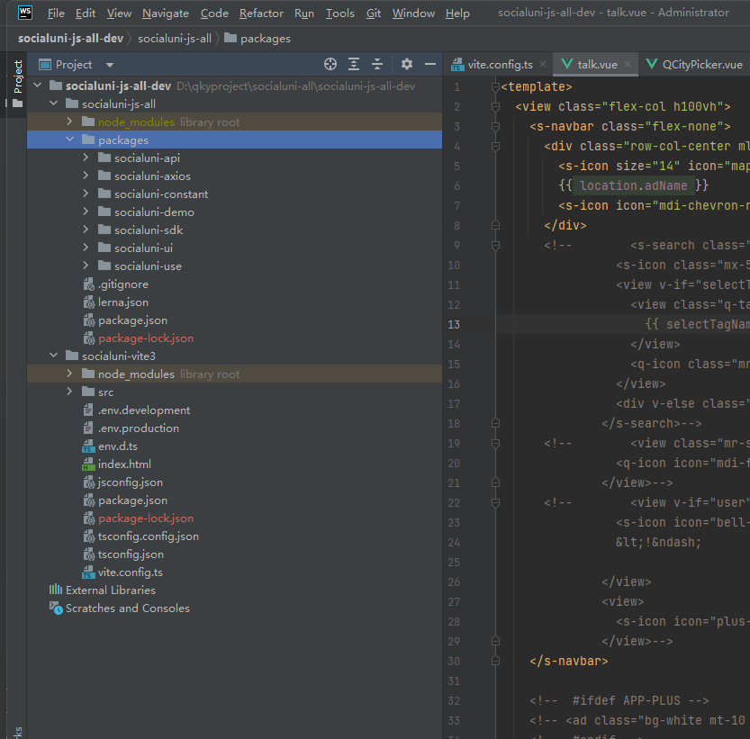

# 搭建环境步骤
## 依赖项目
- 需要node16版本
- [js-all](https://gitee.com/socialuni/socialuni-js-all)
## 项目结构


## 安装依赖
```
cd socialuni-js-all
npm install
cd ../socialuni-vite3
npm install
```
## run项目
然后在vite3那个项目根目录执行
`npm run dev:h5`


socialuni 演示项目 uniapp版本

